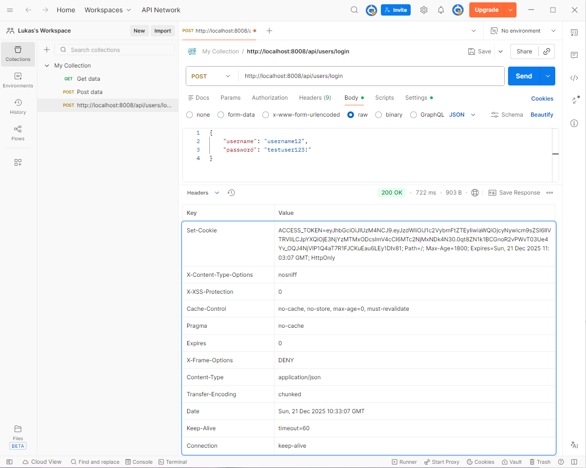
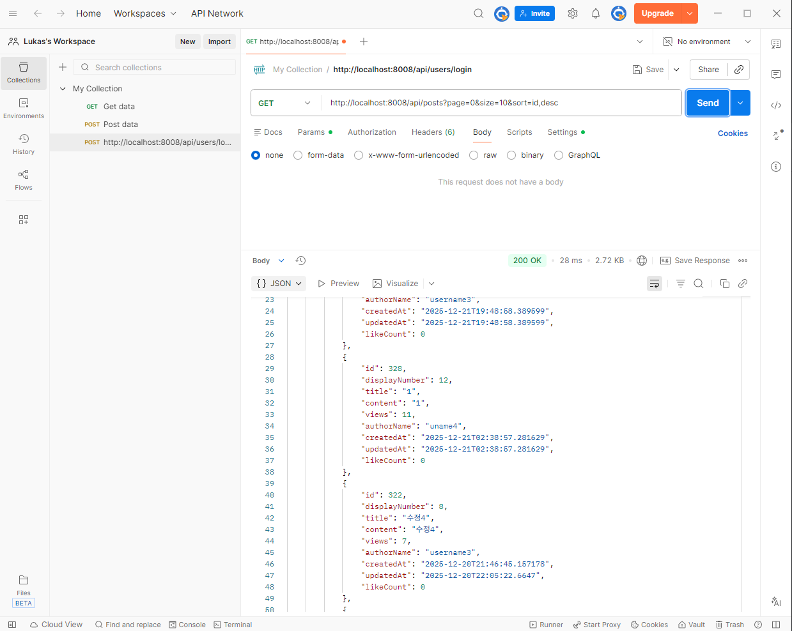
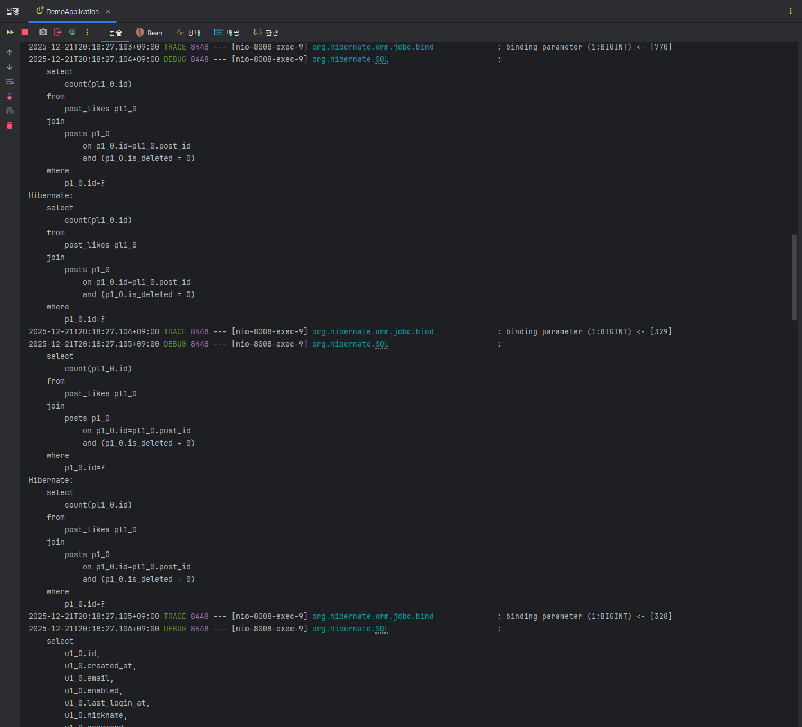
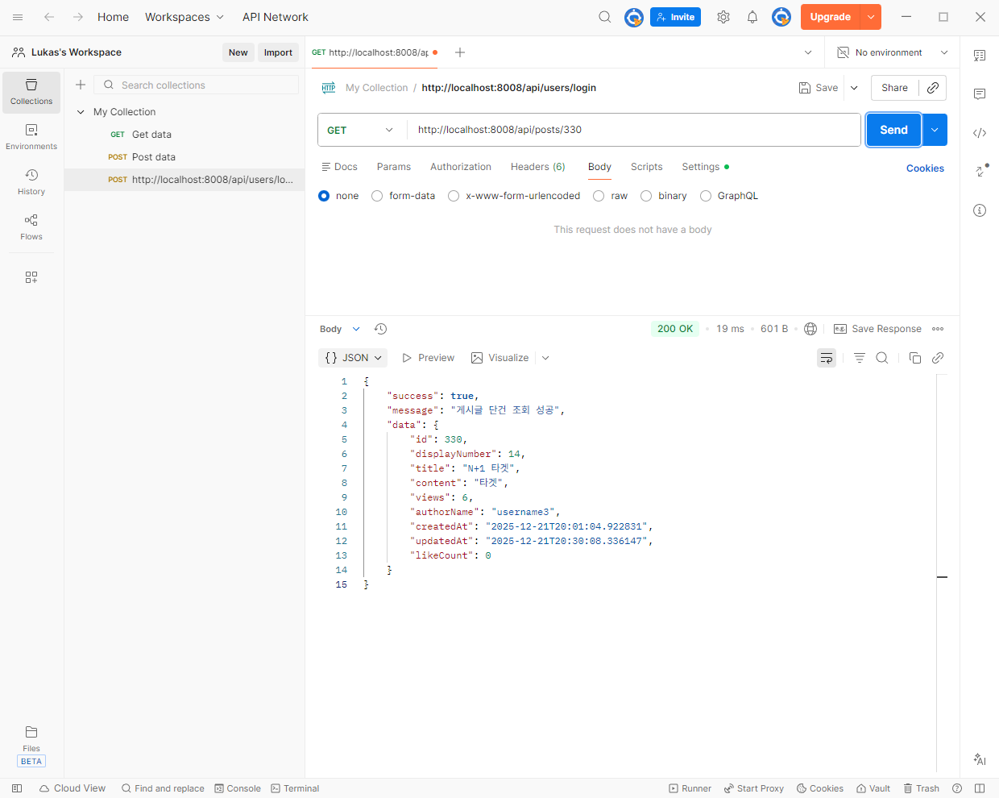
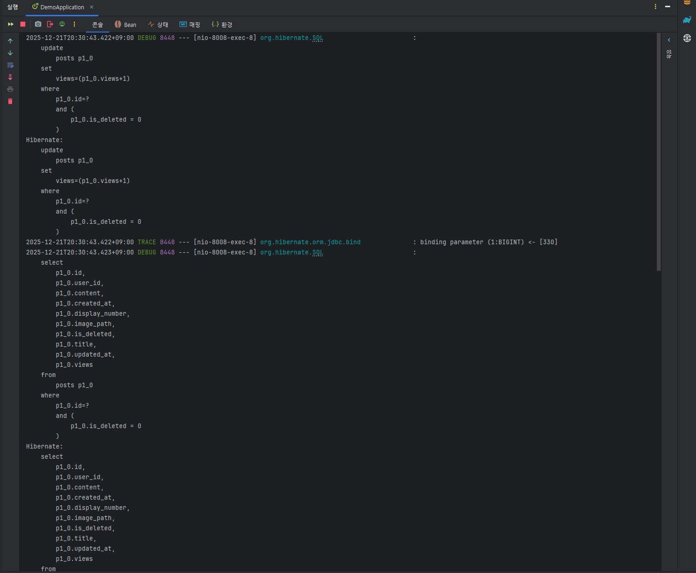
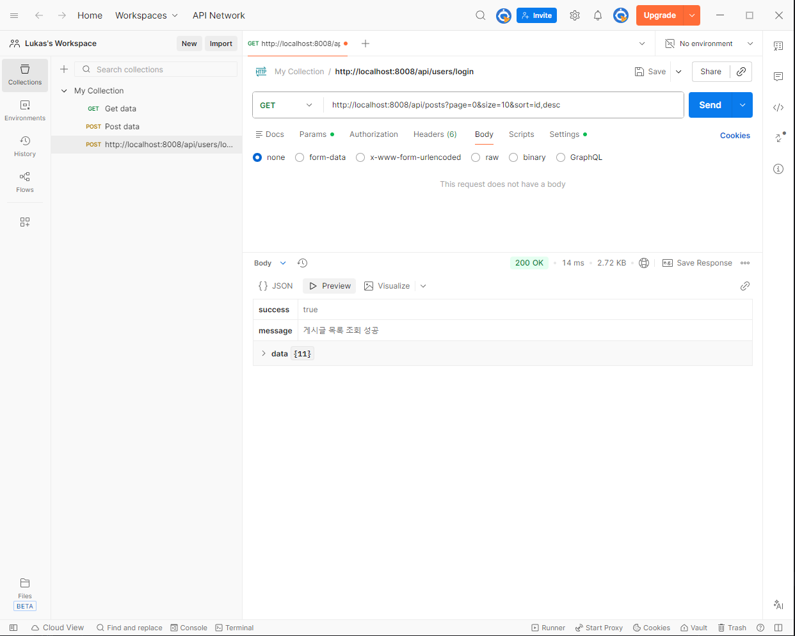
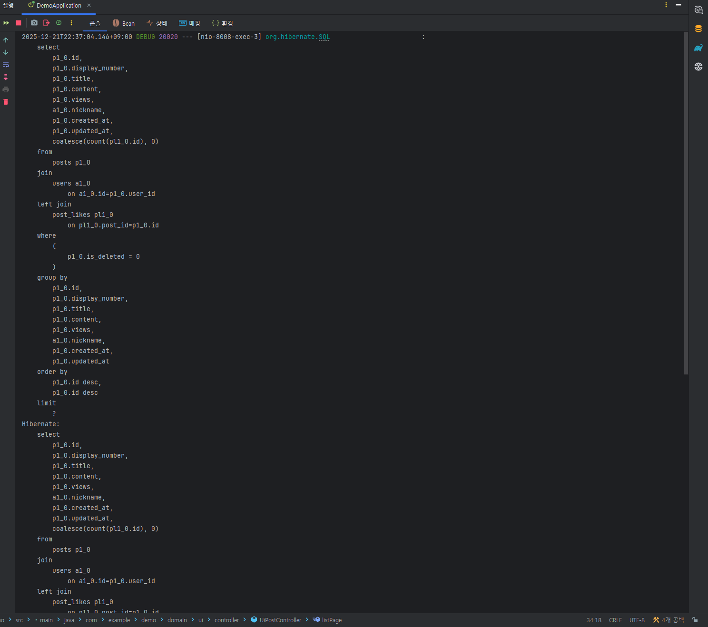
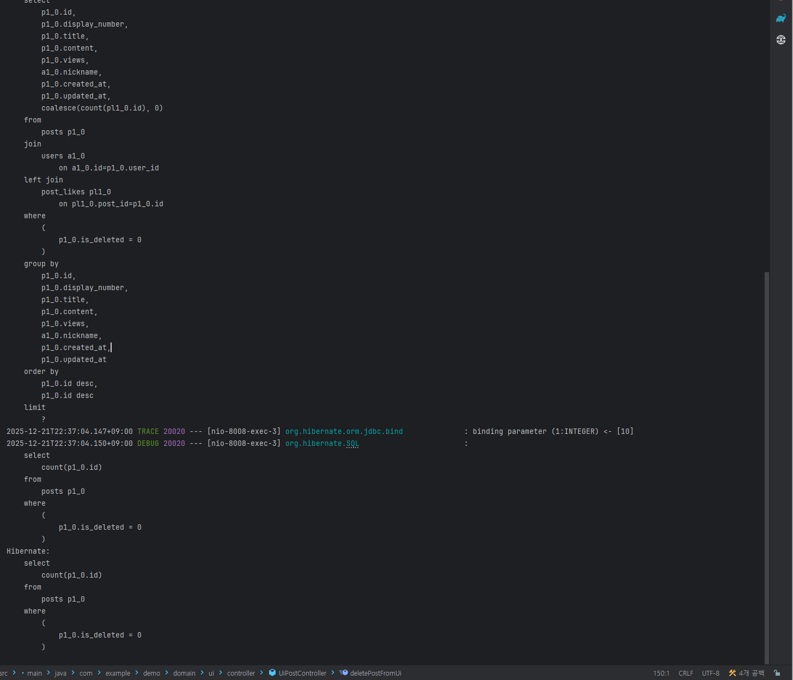

# 4-1. 게시글 조회 성능 개선 (N+1) 검증 기록

## 0. 테스트 전제
- 인증이 필요한 API 테스트를 위해 로그인 후 JWT(HttpOnly 쿠키) 기반 인증 상태를  
  유지하고, Postman을 통해 API 요청을 수행하였습니다.
  >
---

## 1. Before 시나리오 A: 게시글 목록 조회

### 1-1. 요청 정보
- Method: `GET`
- Endpoint: `/api/posts?page=0&size=10&sort=id,desc`
- 요청 목적: 게시글 목록 조회

### 1-2. Postman 요청/응답 결과
- HTTP Status: 200 OK
- 응답 시간: 28 ms
- 응답 데이터: 게시글 목록 10건 반환
  >

### 1-3. Hibernate SQL 로그
게시글 목록 조회 요청 1회 시 실행된 SQL 로그를 확인한 결과,
다음과 같은 쿼리 실행 패턴을 확인할 수 있었습니다.

- 게시글 목록 조회 쿼리: 1회
- 게시글 수(10건)에 따라 반복 실행된 쿼리
    - 작성자(users) 조회 쿼리: 게시글 수와 동일하게 반복
    - 좋아요(post_likes count) 조회 쿼리: 게시글 수와 동일하게 반복

즉, 검증 환경 및 현재 구현 기준으로 게시글 목록 조회 1회 요청에 대해  
**최소 2 + (게시글 수 × 2) 형태의 쿼리가 실행됨**을 로그로 확인하였습니다.
> 

---

## 2. Before 시나리오 B: 게시글 상세 조회

### 2-1. 요청 정보
- Method: `GET`
- Endpoint: `/api/posts/{postId}`
- 요청 목적: 게시글 단건 상세 조회

### 2-2. Postman 요청/응답 결과
- HTTP Status: 200 OK
- 응답 시간: 19 ms
- 응답 데이터: 게시글 단건 + 작성자 + 좋아요 정보 반환

  >

> ### 2-3. Hibernate SQL 로그
- 게시글 단건 조회 쿼리 실행
- 조회수 증가(update) 쿼리 실행
- 단건 조회이므로 반복 쿼리 패턴은 확인되지 않았습니다.

  >

---

## 3. 정리

- 게시글 목록 조회(A 시나리오)는 조회 대상 수가 증가할수록  
  실행되는 SQL 쿼리 수가 선형적으로 증가하는 구조인 것을 확인했습니다.
- 반면, 게시글 단건 조회(B 시나리오)는  
  조회 대상이 1건으로 고정되어 있어 반복 쿼리 문제가 발생하지 않았습니다.
- 이로 인해, 목록 조회 API는 데이터 규모 증가 시  
  성능 저하 가능성이 높은 구조라는 것을 Before 단계에서 확인했습니다.

---

## 4. After 목표 (성공 기준)

- Before(A): 최소 2 + (N x 2) 쿼리 (N=10일 경우 22회)
- After(A) 목표: 쿼리 수를 상수로 고정
    - 목록 조회 1회 + count 1회 = 총 2회

---

## 5. After 시나리오 A: 게시글 목록 조회 (개선 후 재검증)

### 5-1. 요청 정보
- Method: `GET`
- Endpoint: `/api/posts?page=0&size=10&sort=id,desc`
- 요청 목적: 게시글 목록 조회

### 5-2. Postman 요청/응답 결과
- HTTP Status: 200 OK
- 응답 시간: 14 ms
- 응답 데이터: 게시글 목록 10건 반환
  >

### 5-3. Hibernate SQL 로그
게시글 목록 조회 요청 1회 시 실행된 SQL 로그를 확인한 결과,  
다음과 같은 쿼리 실행 패턴을 확인할 수 있었습니다.

- 게시글 목록 조회 쿼리 1회
    - posts, users 테이블 JOIN
    - post_likes 테이블 LEFT JOIN
    - count 집계 및 GROUP BY 적용
    - limit 적용
      >

- 페이징 처리를 위한 count 쿼리: 1회
  >

이를 통해, 게시글 수와 무관하게  
**목록 데이터**를 조회하기 위한 쿼리 1회와  
**페이징 처리**를 위한 전체 개수 조회(count) 쿼리 1회가  
각각 실행되는 구조임을 확인할 수 있었습니다.

또한 Before 단계에서 확인되었던  
users 및 post_likes 관련 반복 쿼리(N+1)는  
After 단계에서는 더 이상 발생하지 않았습니다.

---

## 6. Before & After 비교

아래 표는 게시글 목록 조회(A 시나리오)를 기준으로  
개선 전(Before)과 개선 후(After)의 쿼리 실행 구조를 비교한 결과입니다.

| 구분 | Before (개선 전)                               | After (개선 후) |
|----|---------------------------------------------|----------------|
| 목록 데이터 조회 | 게시글 목록 조회 1회                                | JOIN 기반 목록 조회 1회 |
| 연관 데이터 접근 | 게시글 수(N)에 비례하여  users / post_likes 반복 조회 | 조회 시 함께 처리 |
| 페이징 보조 쿼리 | count 쿼리 1회                                 | count 쿼리 1회 |
| 전체 쿼리 구조 | 최소 2 + (N × 2)                              | 총 2회 |
| N+1 문제 | 발생                                          | 제거 |
| 쿼리 예측 가능성 | 낮음                                          | 높음 |

Before 단계에서는 게시글 목록 조회 이후,  
게시글 수에 비례하여 작성자(users) 조회 쿼리와  
좋아요(post_likes) 집계 쿼리가 반복 실행되는 구조를 확인할 수 있었습니다.

반면 After 단계에서는 조회 전용 DTO를 활용하여  
Repository에서 게시글 목록 데이터를 직접 조회하도록 구조를 변경하였습니다.  
그 결과, 목록 데이터를 조회하기 위한 쿼리 1회와  
페이징 처리를 위한 전체 개수 조회(count) 쿼리가  
각각 한 번씩 실행되는 구조로 개선되었습니다.

이를 통해, 게시글 수 증가 여부와 관계없이  
게시글 목록 조회 API의 쿼리 실행 패턴을  
예측 가능한 형태로 유지할 수 있음을 확인하였습니다.

---

## 7. 최종 정리

본 Case에서는 게시글 목록 조회 API를 대상으로  
Hibernate SQL 로그를 통해 N+1 문제가 실제로 발생함을 검증하고,  
조회 구조 개선을 통해 해당 문제를 제거하는 과정을 기록하였습니다.

엔티티 조회 이후 연관 데이터를 개별적으로 접근하던 기존 방식 대신,  
조회 전용 DTO를 활용하여 Repository에서 필요한 데이터를 직접 조회하도록 구조를 변경함으로써  
게시글 수 증가와 무관하게  
쿼리 실행 패턴을 예측 가능한 형태로 유지할 수 있음을 확인하였습니다.

이를 통해, 목록 조회와 같이 빈번하게 호출되는 API의 경우  
연관 데이터 접근 방식에 따라 **쿼리 구조로 인한 성능 저하 가능성**이 발생할 수 있음을 인지하고,  
로그 기반 검증과 구조적 개선을 통해  
문제를 사전에 제거하는 접근이 중요함을 확인할 수 있었습니다.