# 4-2. 좋아요 기능 동시성 문제 개선 (Concurrency)

---

## 0. 테스트 전제 (테스트 환경 및 공통 조건)

본 Case의 테스트는 목적에 따라  
Postman, Postman Runner, JUnit 동시성 테스트 방식으로 수행되었으며,  
아래의 공통 전제를 기준으로 테스트를 진행하였습니다.

- 인증이 필요한 API 테스트를 위해  
  로그인 후 JWT(HttpOnly 쿠키) 기반 인증 상태를 유지하였습니다.
- Postman을 사용하여 API 요청을 수행하였습니다.

### 이번 Case의 해결 전략 요약
- 문제 성격: 다중 요청 환경에서 좋아요 토글 로직이 경쟁 상태(Race Condition)에 놓이며  
  데이터 정합성(likeCount ↔ post_likes row)이 깨질 수 있는 문제로 정의하였습니다.
- DB 무결성: post_likes 테이블에 (post_id, user_id) UNIQUE INDEX를 적용하여  
  중복 row 생성을 DB 레벨에서 물리적으로 차단하였습니다.
- 최종 정합성: 동시 요청 중 예외가 발생하더라도  
  최종 상태 및 응답은 DB 재조회 결과를 기준으로 확정하도록 설계하였습니다.

### 관련 산출물
> 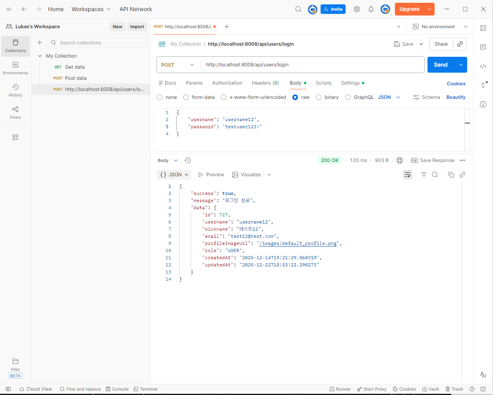  
> 인증 상태 확보

> 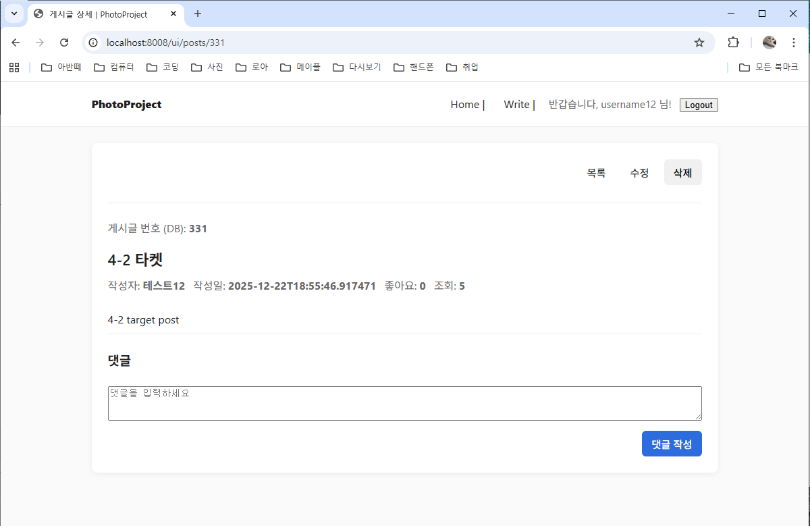  
> ( post_id: 331 | 좋아요 0 )

---

## 1. 테스트 대상 및 단일 요청 정상 동작 확인

### 목적
- 테스트 대상 게시글이 실제 DB에 존재함을 확인하고  
  좋아요 토글 API가 단일 요청 환경에서 정상 동작함을 검증하였습니다.

### 검증 내용
- DB에 테스트 대상 게시글(postId = 331)이 실제로 존재함을 확인하였습니다.
- Postman을 통한 좋아요 토글 API 요청을 1회 수행하였습니다.
- HTTP 200 응답 반환 및 좋아요 수 정상 증가를 확인하였습니다.

### 관련 산출물
> 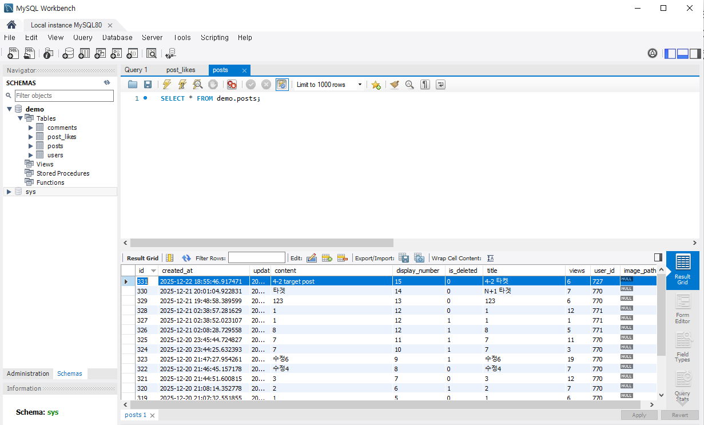  
> ( post_id : 331 | user_id : 727 )

> 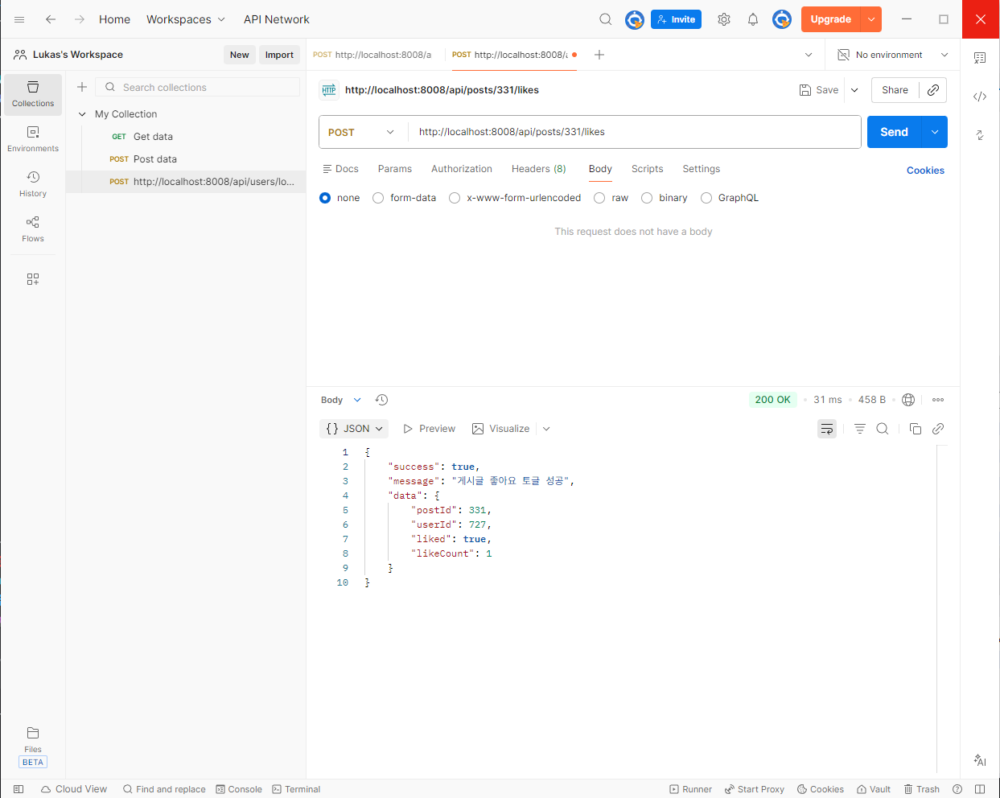  
> 좋아요 1회 요청 결과 (200 OK)

> 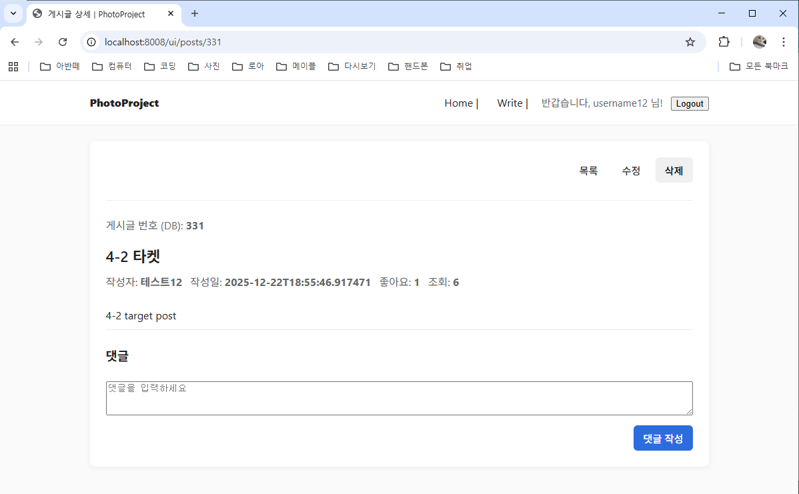  
> 좋아요 수 1 증가 확인

---

## 1-1. 단일 사용자 다중 요청 시나리오 (Postman Runner)

### 목적
- 동일 사용자 / 동일 게시글에 대해  
  짧은 시간 동안 다수의 좋아요 토글 요청이 발생하는 상황을 재현하여  
  Race Condition으로 인한 데이터 정합성 붕괴 가능성을 확인하였습니다.

### 검증 방법
- Postman Collection Runner
- 동일 postId(331)에 대해 좋아요 토글 요청을 20회 연속 수행하였습니다.

### 검증 결과
- 모든 요청이 HTTP 200으로 정상 응답하였습니다.
- 요청 성공 여부만으로는  
  실제 데이터 정합성을 판단하기 어려운 상태임을 확인하였습니다.

### 관련 산출물
> 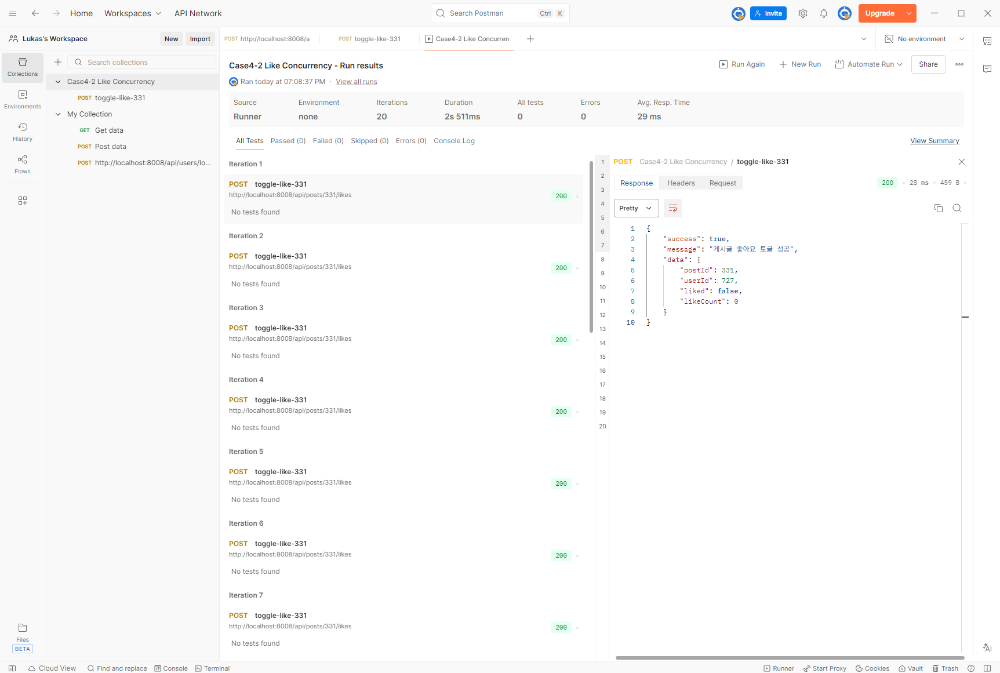  
> Postman Runner 실행 결과

> 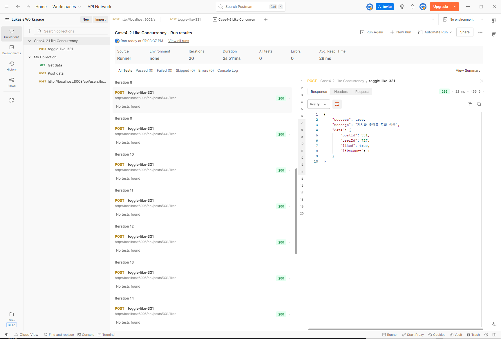  
> Postman Runner 실행 결과

> 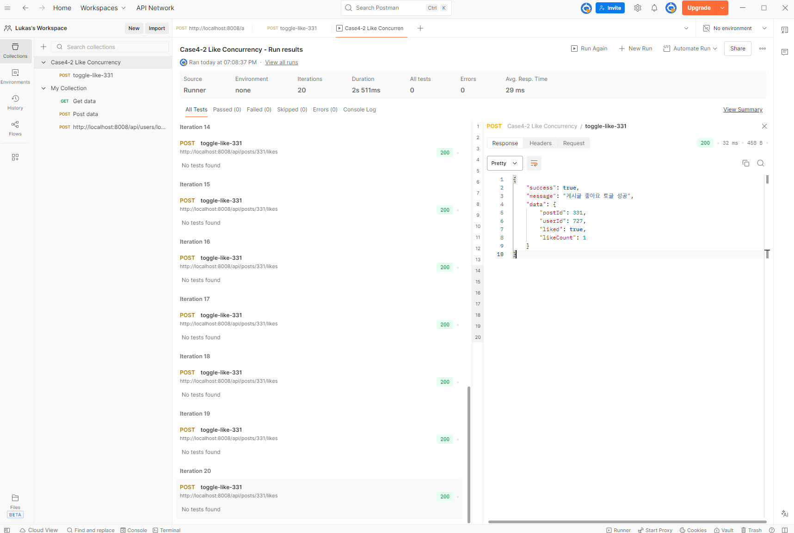  
> Postman Runner 실행 결과

---

## 2. Before 검증 – DB 상태 직접 확인

### 목적
- API 응답과 무관하게  
  실제 DB 상태를 기준으로 데이터 정합성 여부를 판단하였습니다.

### 검증 내용
- 동일 (post_id, user_id) 조합에 대한 중복 row 존재 여부를 확인하였습니다.
- DB 기준 좋아요 수를 확인하였습니다.

### 관련 산출물
>   
> 중복 row 존재 여부 확인 (0 rows)

>   
> 특정 Post/User 조합 row 상태 확인

> 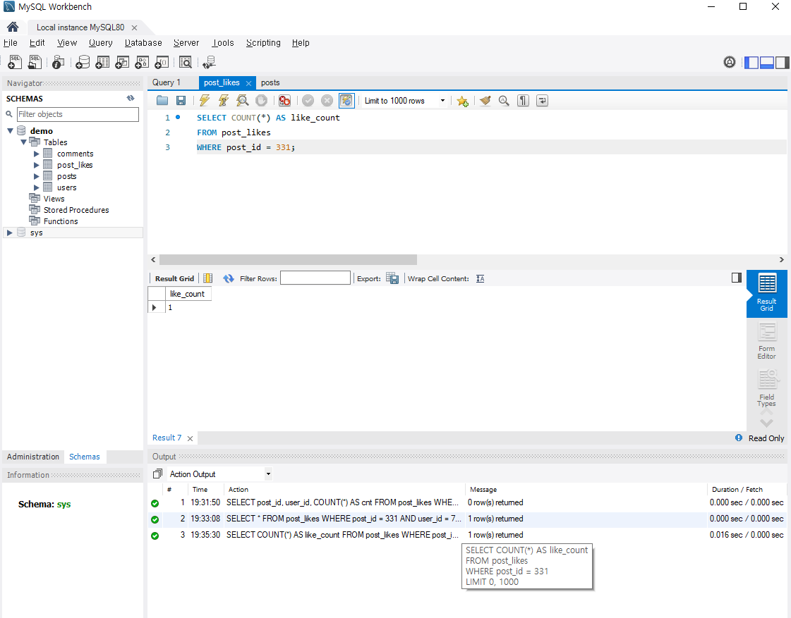  
> DB 기준 좋아요 수 확인

---

## 3. Before 검증 – JUnit 동시성 테스트 (1차)

### 목적
- 코드 레벨에서 실제 동시 요청 상황을 재현하여  
  서비스 로직이 동시성 충돌 상황에서 어떻게 동작하는지 확인하였습니다.

### 검증 내용
- 다수의 스레드가 동시에 좋아요 토글 로직을 실행하였습니다.
- 테스트 수행 중 다음과 같은 예외가 다수 발생하였습니다.
    - DataIntegrityViolationException
    - ObjectOptimisticLockingFailureException
    - Hibernate AssertionFailure

### 관찰 결과
- 다수의 예외가 발생하였으나  
  테스트 흐름은 중단되지 않고 끝까지 수행되었습니다.
- 테스트 종료 시점 기준  
  DB 상태는 단일 상태로 수렴하였습니다.

### 관련 산출물
> 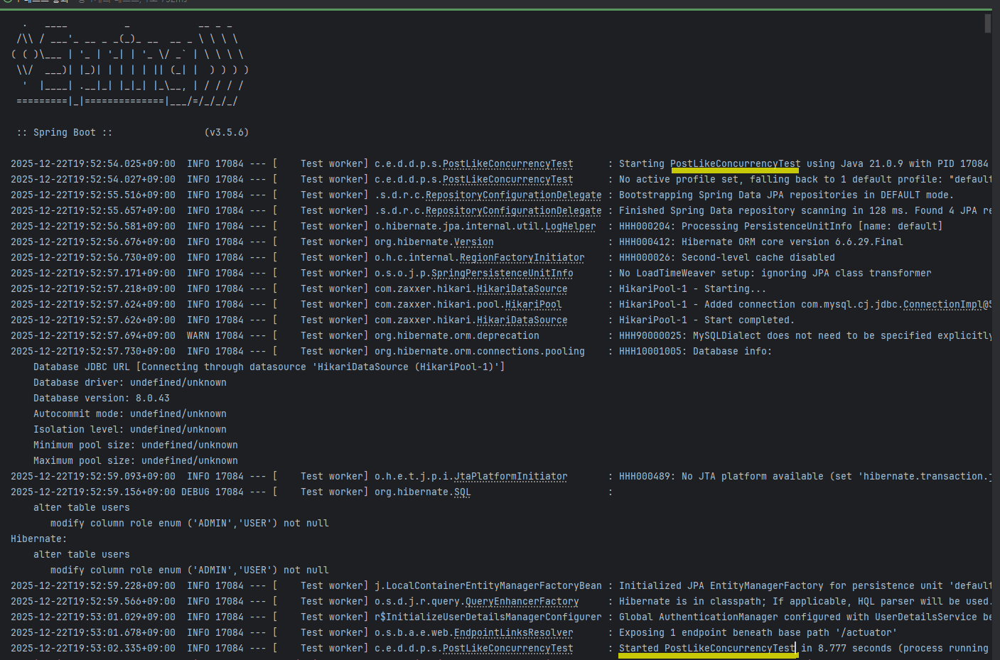  
> JUnit 동시성 테스트 시작

> 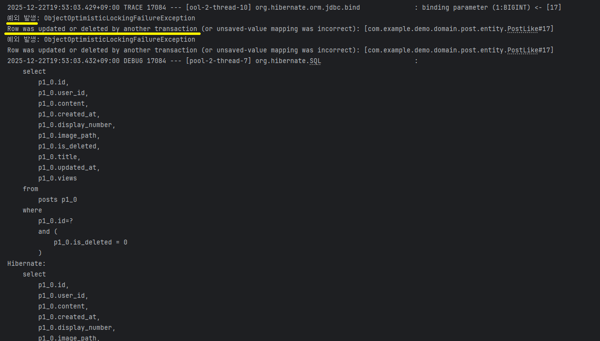  
> 동시 요청 중 DB UNIQUE 제약 예외 발생 로그

> 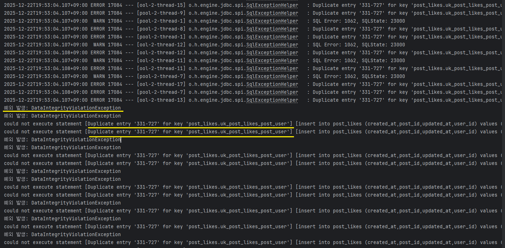  
> 동시 요청 중 추가 예외가 발생하였으나  
> 테스트 실행 흐름은 중단되지 않음

> 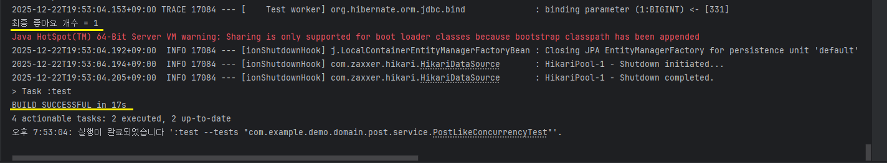  
> 테스트 정상 종료 및 최종 상태 출력

---

## 4. 개선 방향 정립 (핵심 장치)

- 동시성 충돌 자체를 제거하거나  
  예외 발생의 강제적 차단보다는,  
  DB를 최종 기준(Source of Truth)으로 설정하였습니다.
- (post_id, user_id) UNIQUE INDEX를 통해  
  중복 데이터 저장을 DB 레벨에서 차단하였습니다.
- 동시 요청 중 예외가 발생하더라도  
  최종 상태 및 응답은 DB 재조회 결과를 기준으로 확정하도록 개선하였습니다.

### 관련 산출물
> 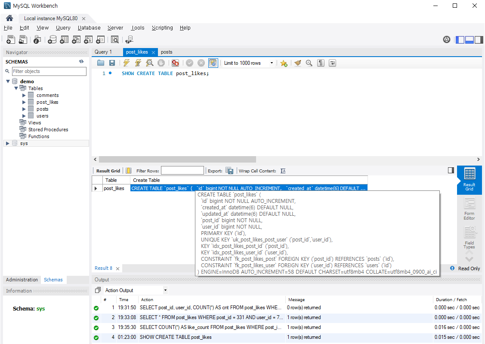  
> post_likes 테이블 UNIQUE 제약 확인

---

## 5. After 검증 – JUnit 동시성 테스트 (2차)

### 목적
- 개선 적용 이후 동일한 동시성 테스트를 재수행하여  
  시스템이 최종 상태로 수렴하는지 재검증하였습니다.

### 검증 내용
- 동시 요청 중 예외는 여전히 발생하는 것을 확인하였습니다.
- 테스트 실행 흐름은 중단되지 않았습니다.
- 모든 스레드 실행 완료 후 테스트는 정상 종료되었습니다.

### 관련 산출물
> 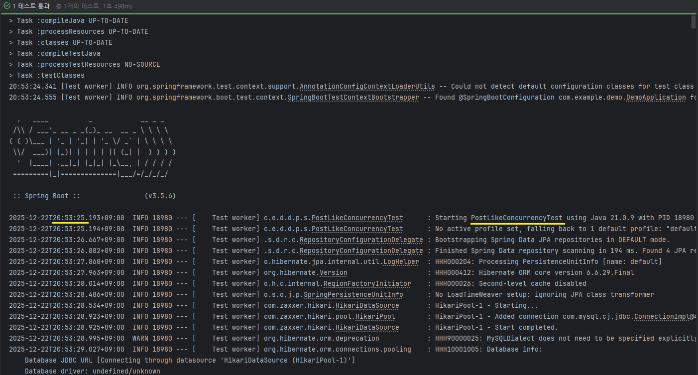  
> 개선 후 동시성 테스트 시작

> 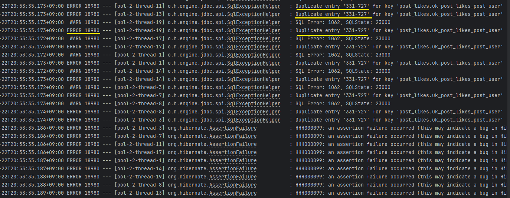  
> 예외 발생 로그 (흐름 중단 없음)

> 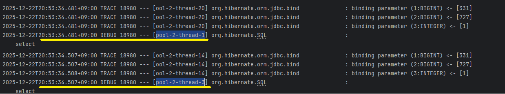  
> 다수 스레드 동시 실행 증명

> 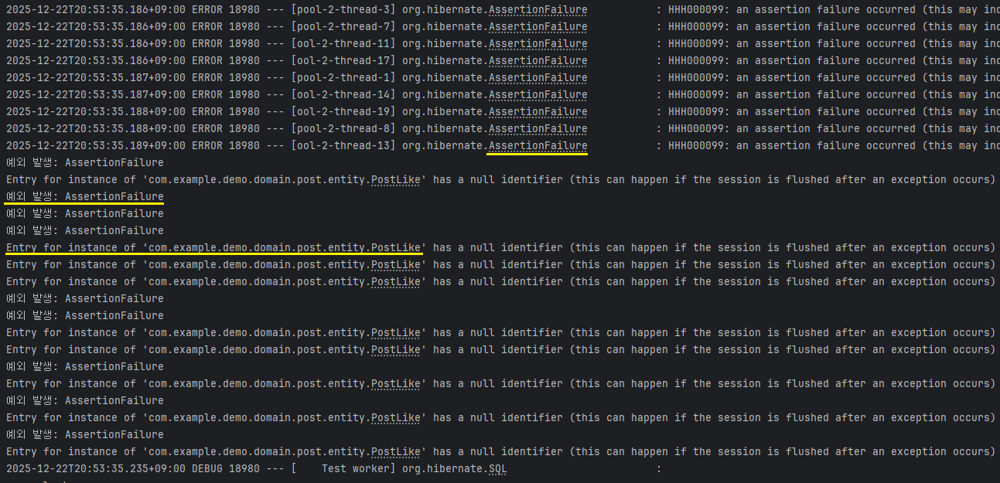  
> AssertionFailure 발생 로그

> 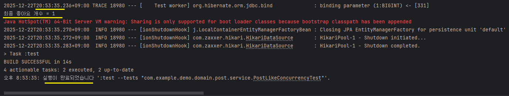  
> 테스트 정상 종료 확인

---

## 6. After 검증 – DB 최종 상태 확인

### 목적
- 예외 발생 이후에도  
  DB 상태가 일관되게 수렴했음을 확인하였습니다.

### 관련 산출물
> 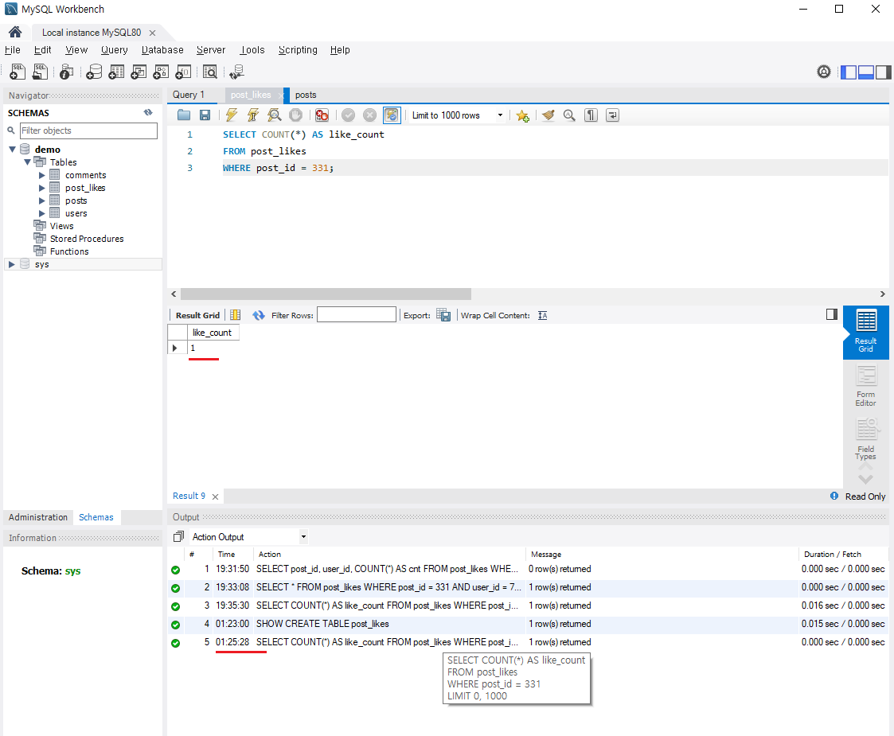  
> DB 기준 최종 좋아요 수 확인

---

## 7. Before & After 비교 요약

| 구분 | Before (개선 전) | After (개선 후)       |
| --- | --- |--------------------|
| 동시 요청 환경 | Race Condition 발생 | Race Condition 발생  |
| 예외 발생 여부 | 예외 발생 | 예외 발생              |
| 예외 처리 관점 | 예외 발생 시 흐름 통제 기준이 명확하지 않음 | 의도된 예외 처리를 통해 시스템 안정성 확보 |
| 데이터 무결성 | 정합성 보장 기준 불명확 | DB 무결성 기준으로 일관성 유지 |
| 최종 상태 | 결과 수렴 보장 어려움 | 최종 상태 항상 일관되게 수렴   |

---

## 8. 최종 정리

본 Case에서는 좋아요 기능을 대상으로  
다중 요청 환경에서 발생 가능한 Race Condition과  
그로 인한 데이터 정합성 붕괴 가능성을 검증하였습니다.

예외를 제거하는 방식이 아닌,  
DB를 최종 기준(Source of Truth)으로 삼고  
UNIQUE 제약과 DB 재조회 기반 응답 확정을 통해  
시스템이 항상 일관된 상태로 수렴하도록 개선하였습니다.
