## 4-3. 인증·인가 실패 흐름의 정책 정리 (Authentication & Authorization Failure Policy)

---

### 문제 정의 (요약)
photoProject에서는 인증(Authentication) 및 인가(Authorization) 실패가  
실제 API 요청 과정에서 이미 발생하고 있음을 확인했습니다.  

본 Case는 실패 자체를 다루기보다,  
동일한 실패 조건임에도 상태코드가 일관되지 않게 표현되던 지점을  
정책 관점에서 정리하고 검증하기 위해 진행했습니다.  

### 실험 전제 — 실데이터 기반 검증

본 Case는 기능 동작 확인을 위한 임의 테스트 데이터가 아닌,  
photoProject 실행 환경의 실제 DB 데이터를 기반으로 검증을 진행했습니다.

요청 실패가 단순히 “리소스가 존재하지 않아서” 발생한 것이 아니라,  
인증(Authentication) 또는 인가(Authorization) 조건에 의해  
발생했음을 명확히 분리하기 위함입니다.

실험에 사용된 데이터는 다음과 같습니다.

- 실제 사용자 데이터가 DB에 존재함을 확인  
  > 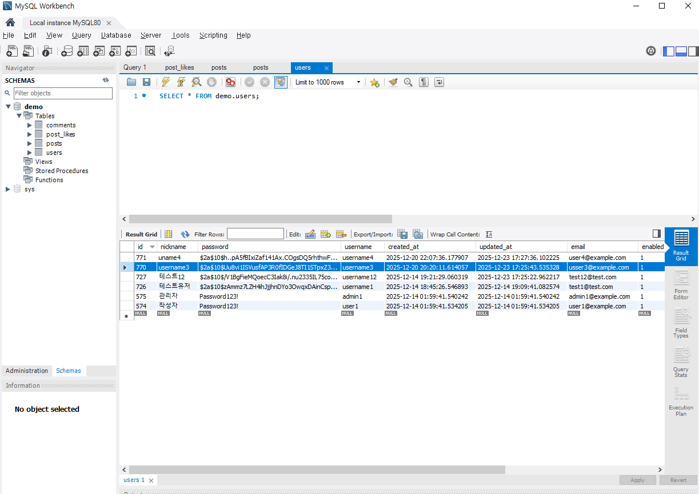

- 실제 게시글 데이터가 DB에 존재함을 확인  
  > 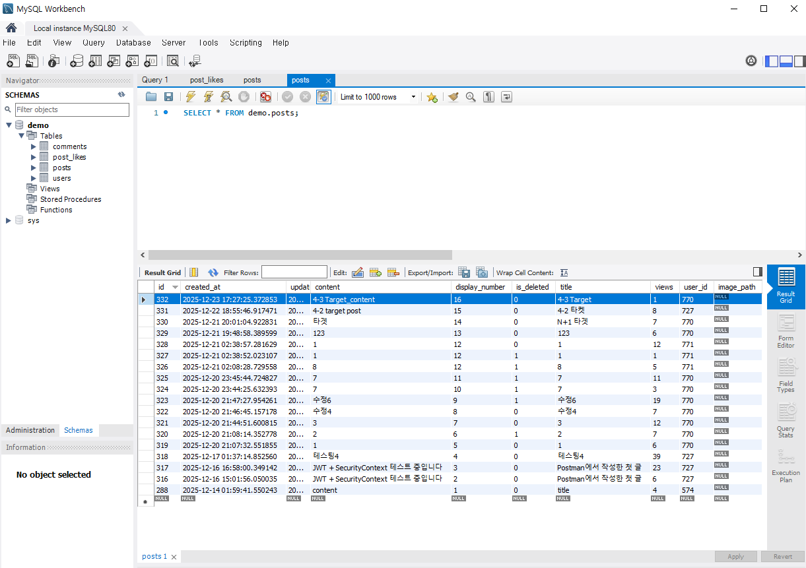

- 실제 댓글 데이터가 DB에 존재함을 확인  
  > 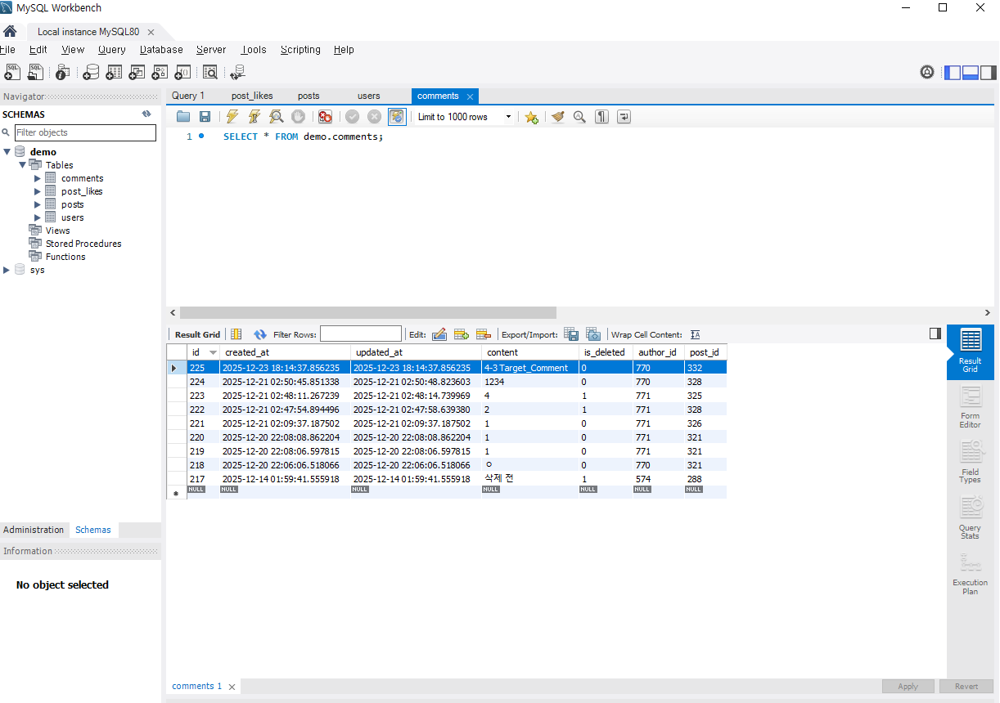

이 전제를 통해,
이후 발생하는 모든 실패 응답은
데이터 부재가 아닌 인증·인가 조건에 의해 발생했음을 보장합니다.

---

### 문제 정의 (상세)

photoProject는 인증(Authentication)과 인가(Authorization)를 포함한  
기본적인 보안 흐름이 이미 구현된 상태였습니다.  
실제 API 요청 과정에서도 인증·인가 실패는 정상적으로 발생하고 있었습니다.

다만 구현 이후,  
요청과 응답 흐름을 상태코드 관점에서 점검하는 과정에서  
다음과 같은 의문을 갖게 되었습니다.  

- 동일한 “권한 없음” 상황임에도  
  API에 따라 400과 403이 혼재되어 반환되고 있지는 않은지
- 인증 실패와 인가 실패가  
  상태코드만 보고도 명확히 구분 가능한지
- 실패의 원인이  
  비즈니스 오류인지, 보안 정책 위반인지  
  응답만 보고 판단할 수 있는 구조인지

이러한 문제는 기능 동작 자체에는 큰 영향을 주지 않지만,  
운영 관점에서는 다음과 같은 한계를 가질 수 있습니다.

- 클라이언트가 실패 원인을 정확히 해석하기 어려움  
- API 사용자가 “잘못된 요청”과 “권한 부족”을 구분하기 어려움  
- 보안 실패가 단순 예외 처리 결과처럼 보일 위험  

이에 따라  
새로운 기능을 추가하거나 보안 개념을 나열하는 방식이 아닌,  
이미 발생하고 있던 인증·인가 실패 흐름을  
실데이터 기반으로 재현하고,  
상태코드 정책 관점에서  
의도한 대로 표현되고 있는지를 검증하고자 했습니다.  

---

### 검증 기준

본 Case에서는 실패를 다음 기준으로 구분했습니다.

인증 실패(Authentication Failure)는,  
요청자가 시스템에 의해 `식별되지 않는 상태`를 의미하며  
다음과 같은 경우를 포함합니다.  

- 로그인되지 않은 상태
- 인증 정보(JWT / Cookie)가 존재하지 않거나 제거된 상태

이 경우 기대되는 상태코드는 **401 Unauthorized**입니다.

인가 실패(Authorization Failure)는,  
요청자는 인증되었으나  
요청 리소스에 대한 `권한을 가지지 않은 상태`를 의미합니다.  

이 경우 기대되는 상태코드는 **403 Forbidden**입니다.  

※ 실무 환경에서는 리소스 존재 여부를 숨기기 위해  
권한이 없는 경우에도 404로 응답하는 전략이 사용되기도 합니다.  
본 프로젝트에서는 실패 원인을 명확히 전달하는 것을 목표로 하여,  
인증 실패는 401, 인가 실패는 403으로 표현하는 정책을 채택했습니다.

---

### Step 1. 인증 실패 흐름 검증 (401)

#### 비로그인 상태에서 게시글 생성 시도

로그인하지 않은 상태에서 게시글 생성을 시도했습니다.  

- 요청: `POST /api/posts`
- 결과: `401 Unauthorized`

요청은 컨트롤러나 서비스 로직에 진입하지 않고,  
인증 단계에서 차단되었습니다.  

> 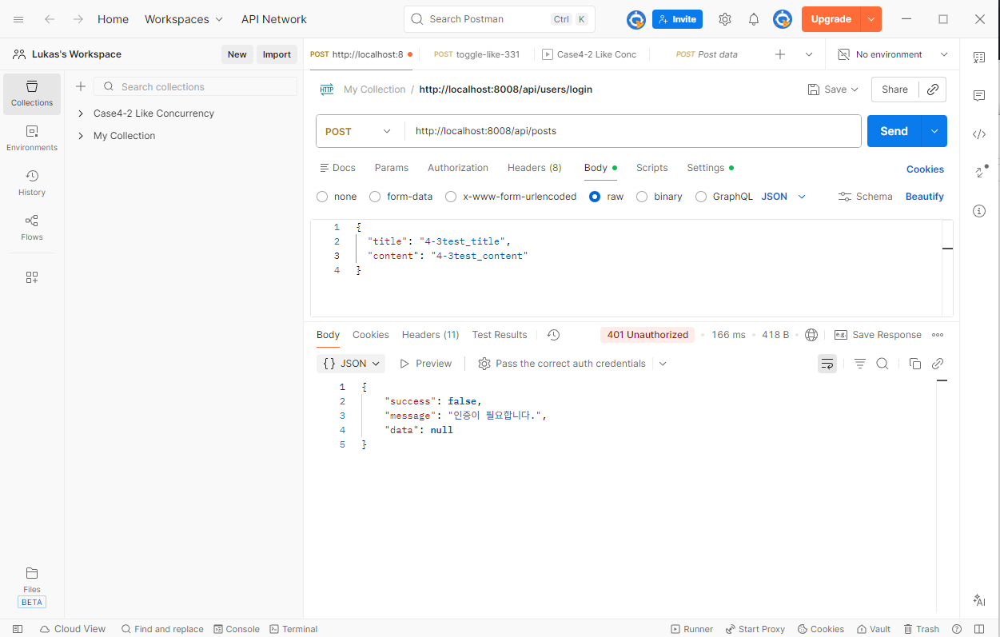

이는 인증 실패가 이미 정책적으로  
401로 일관되게 처리되고 있음을 보여줍니다.  

---

#### 인증 쿠키 제거 후 게시글 삭제 시도

로그인 이후,  
클라이언트(Postman)에서 인증 쿠키를 제거한 뒤  
동일한 게시글 삭제 요청을 다시 시도했습니다.  

- 요청: `DELETE /api/posts/332`
- 결과: `401 Unauthorized`

서버는 해당 요청을  
“인증 정보가 없는 요청”으로 인식하고,  
정상적으로 401을 반환했습니다.  

> 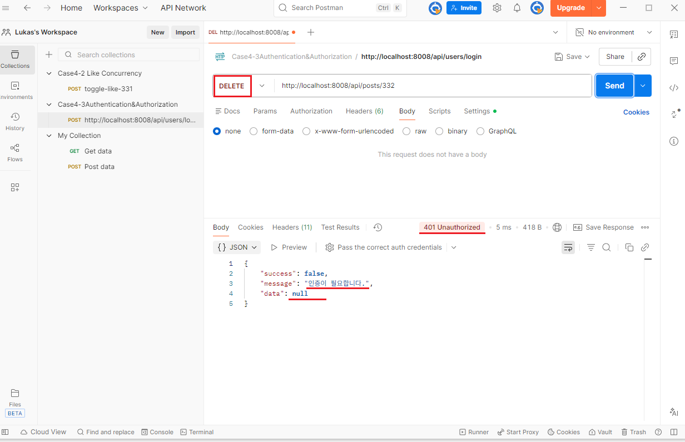

이를 통해,  
로그아웃 여부와 관계없이  
인증 정보가 제거된 요청은  
일관되게 인증 실패로 처리됨을 확인했습니다.  

---

### Step 2. 인가 실패 흐름 검증 — 게시글 삭제  

#### 로그인 후 타인 게시글 삭제 시도 (Before)  

로그인된 상태에서,  
본인이 작성하지 않은 게시글에 대해 삭제 요청을 보냈습니다.  

- 요청: `DELETE /api/posts/332`
- 결과: `400 Bad Request`

> 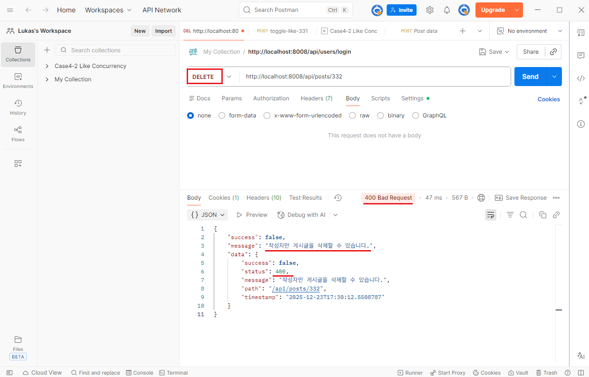  

해당 요청은 “권한 없음” 상황이었음에도,  
인가 실패가 비즈니스 예외로 처리되어   
400 상태코드가 반환되고 있었습니다.  

이는 코드 상에서  
작성자 검증 실패를 `IllegalStateException`으로  
처리하고 있었기 때문입니다.  

> 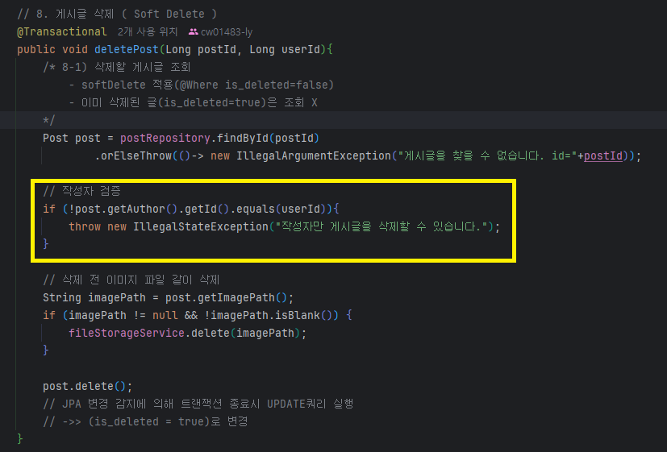

---

#### 정책 수정 — 인가 실패로 재정의

작성자 불일치 상황을  
비즈니스 오류가 아닌  
인가 실패로 명확히 정의했습니다.  

이를 위해,  
예외 타입을 다음과 같이 변경했습니다.  

- 변경 전: `IllegalStateException`
- 변경 후: `org.springframework.security.access.AccessDeniedException`

> 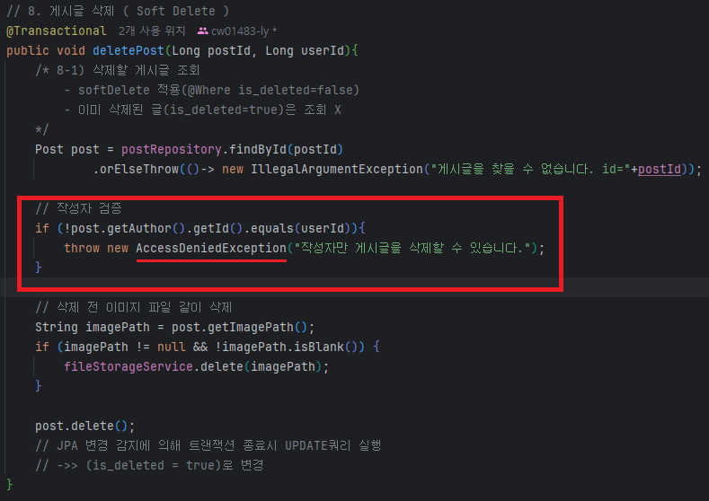

---

#### 동일 요청 재시도 (After)

코드 수정 이후,  
동일한 조건으로 삭제 요청을 다시 시도했습니다.  

- 결과: `403 Forbidden`  

> 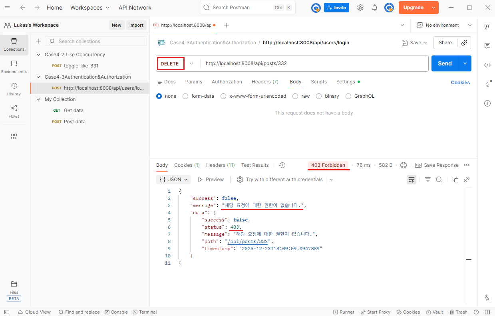

상태코드만 400에서 403으로 변경되었으며,  
실패의 성격이 명확히 드러나도록 개선되었습니다.  

---

### Step 3. 인가 실패 흐름 검증 — 게시글 수정  

#### 로그인 후 타인 게시글 수정 시도 (Before)  

게시글 삭제와 동일한 조건에서,  
타인 게시글에 대한 수정 요청을 시도했습니다.  

- 요청: `PUT /api/posts/332`  
- 결과: `400 Bad Request`  

> 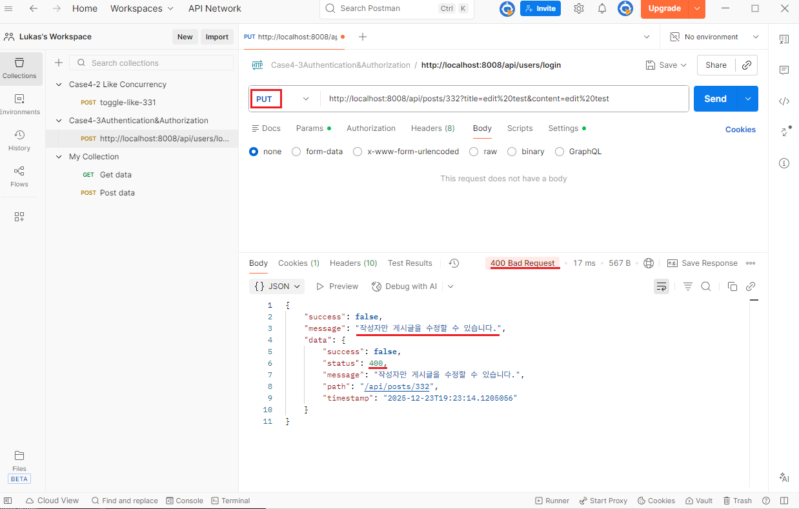

게시글 삭제와 동일한 인가 실패 상황이었으나,  
상태코드는 여전히 400으로 반환되고 있었습니다.  

> 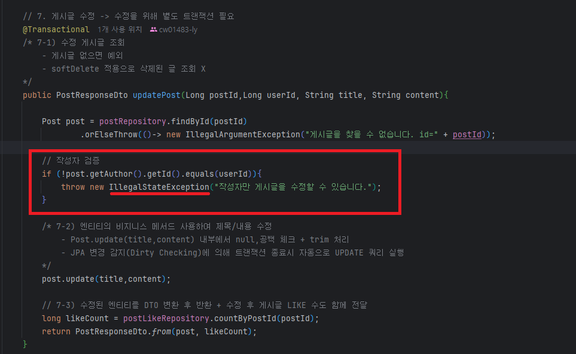

---

#### 정책 수정 및 재시도

게시글 수정 로직에서도  
작성자 검증 실패를  
인가 실패로 통일했습니다.  

> 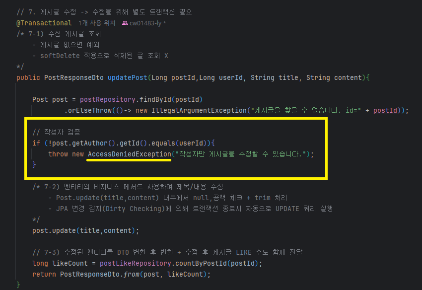

동일 요청을 다시 시도한 결과,  
응답은 다음과 같이 변경되었습니다.  

- 결과: 403 Forbidden  

> 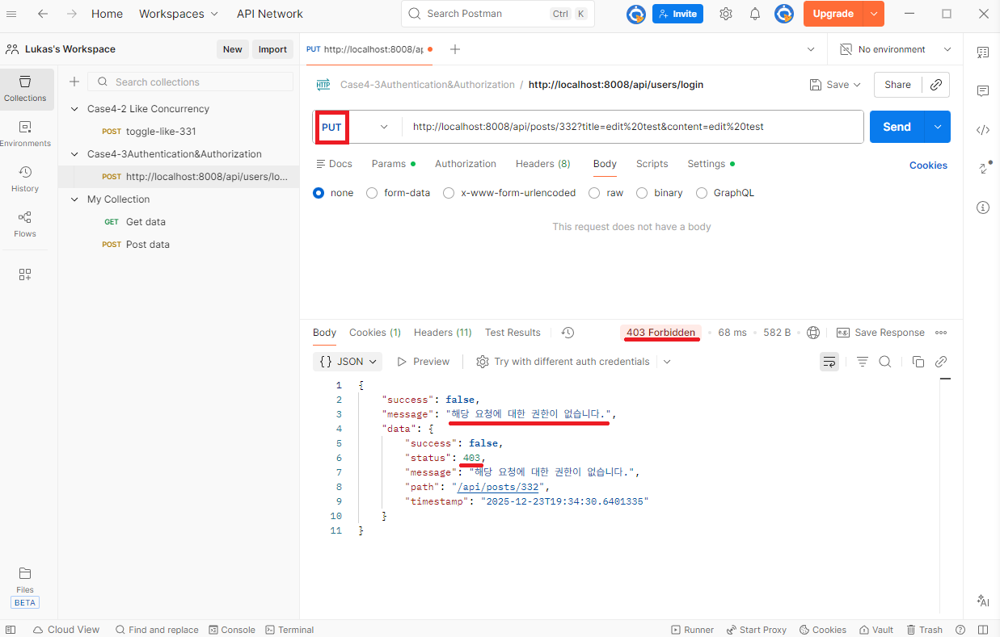

---

#### 인가 실패 처리 흐름에 대한 정책 설명  

본 프로젝트에서는 인가 실패 상황을  
`org.springframework.security.access.AccessDeniedException`으로 표현하여,  
상태코드 판단을 공통 보안 정책 흐름에 위임하는 방식을 사용했습니다.  

이를 통해 컨트롤러 단위에서 상태코드를 직접 분기하지 않고도,  
인가 실패 응답을 일관되게 관리할 수 있도록 구성했습니다.  

---

### Step 4. 인가 실패 흐름 검증 — 댓글 수정

댓글 수정 API는 이미 작성자 검증 실패 시  
`org.springframework.security.access.AccessDeniedException`을
사용하고 있었습니다.

로그인 상태에서  
타인 댓글 수정 요청을 보냈을 때,  
다음과 같은 결과가 반환되었습니다.  

- 요청: `PATCH /api/comments/225`  
- 결과: 403 Forbidden  

> 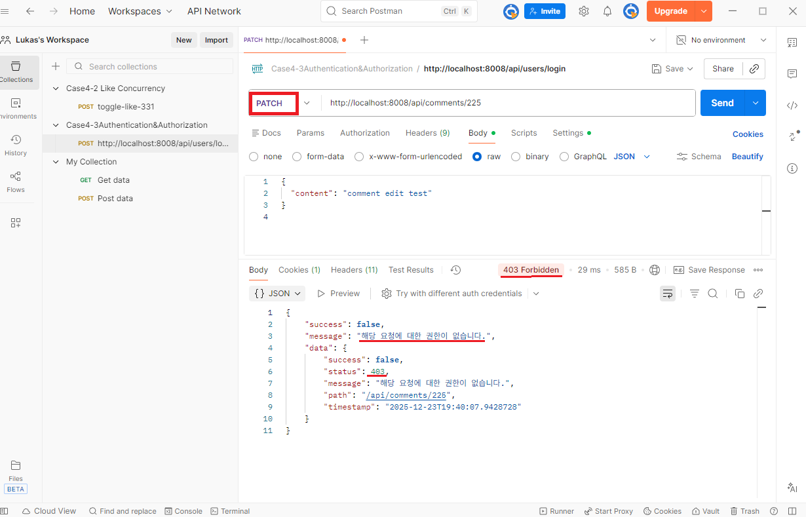

게시글 수정 정책 수렴 이후에도
댓글 API의 인가 실패 흐름은
일관되게 유지됩니다.

---

### 상태코드 변화 비교

| 구분 | 상황 | Before | After |
|----|----|----|----|
| 인증 | 비로그인 요청 | 401 | 401 |
| 인증 | 쿠키 제거 요청 | 401 | 401 |
| 인가 | 타인 게시글 삭제 | 400 | 403 |
| 인가 | 타인 게시글 수정 | 400 | 403 |
| 인가 | 타인 댓글 수정 | 403 | 403 |

---

### 최종 정리

본 Case를 통해 다음을 확인했습니다.  

- 인증 실패는 모든 경우에서  
  401로 일관되게 처리됩니다.  
- 인가 실패는 일부 API에서 400으로 혼재되어 있었으나,  
  게시글 수정·삭제를 기준으로 403으로 정책 수렴이 완료되었습니다.  
- 댓글 API 또한 동일한 인가 실패 정책 흐름을 유지합니다.

이를 통해 photoProject의 인증·인가 실패 처리는  
우연한 예외 처리의 결과가 아니라,  
명확한 기준에 의해 정의된 정책적 결과임을  
실제 요청·응답 산출물로 입증했습니다.
