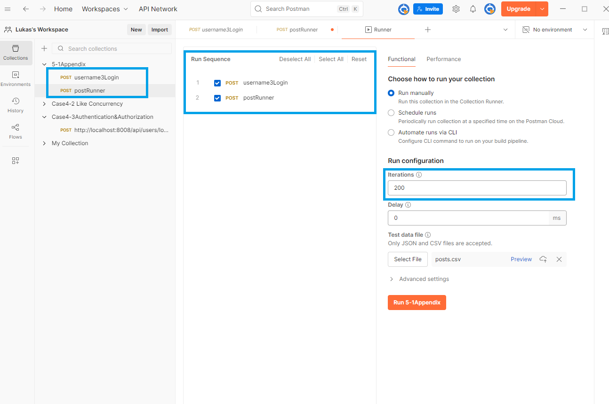
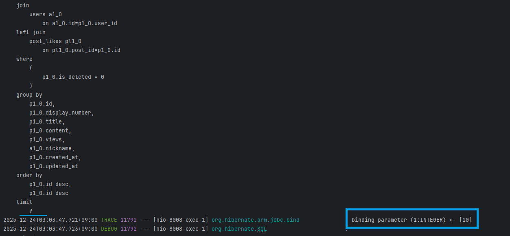
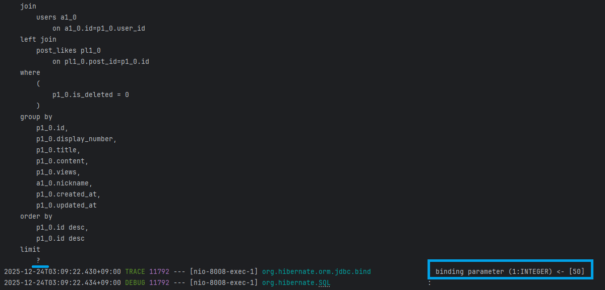
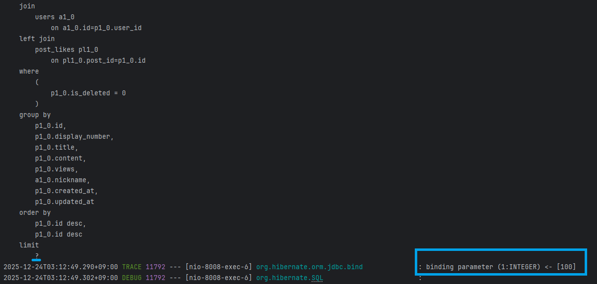

# Appendix 5-1. 페이징(size)에 따른 게시글 목록 조회 실험

---

## 1. 실험 목적

본 실험은 게시글 목록 조회 API에서  
**요청한 페이징 size 값이 실제 DB 조회 단계에 어떻게 반영되는지**와  
**size 변화에 따른 응답 특성을 관찰**하기 위한 보조 실험입니다.

본 실험은 성능 최적화 기법을 검증하기단, Case 4-1(N+1 문제 해결) 이후  
**페이징 동작이 정상적으로 적용되고 있음을 간단히 증명**하는 데 목적이 있습니다.

---

## 2. 실험 환경

- API: `GET /api/posts?page={page}&size={size}&sort=id,desc`
- 환경: Local(Spring Boot + JPA + MySQL)
- 정렬 기준: `id desc`

---

## 3. 실험 데이터 준비

실험을 위해 Postman Runner를 사용하여
게시글 생성 요청을 **200회 반복 실행**하였습니다.

- 로그인 요청 후 인증 상태 유지
- 게시글 생성 API 반복 호출
- 생성된 데이터는 모두 실제 DB에 저장됨

> 

---

## 4. 실험 전제 검증 (데이터 실존성 확인)

본 실험이 실제 데이터를 기준으로 수행되었음을 확인하기 위해
MySQL Workbench를 통해 게시글 테이블을 직접 확인하였습니다.

> 

이를 통해 페이징 실험이
가상의 데이터가 아닌 **실존하는 게시글 데이터를 기반으로 수행**되었음을 확인하였습니다.

---

## 5. 페이징 요청 결과 관찰

서로 다른 size 값으로 게시글 목록 조회 요청을 수행하였으며,  
모든 요청에서 다음 공통 사항을 확인할 수 있었습니다.

- content 배열에는 요청한 size만큼의 게시글만 포함  
- 최신 게시글부터 정렬되어 반환 (`id desc`)  
- Hibernate SQL 로그에서 limit 값이 size에 맞게 바인딩됨  
- 페이징은 응답 단계가 아닌 **DB 조회 단계에서 적용**됨을 확인  

---

## 6. size 값에 따른 결과 비교

| 요청 size | 응답 개수 | SQL limit 바인딩 | 응답 시간(관찰) | 특징 |
|---------|---------|----------------|----------------|------|
| 10 | 10 | limit 10 | 약 10~15ms | 기본 페이징 단위 |
| 50 | 50 | limit 50 | 약 15ms 내외 | 로컬 환경에서 큰 차이 없음 |
| 100 | 100 | limit 100 | 약 100ms 내외 | 응답 크기 증가로 시간 상승 |

> 

> 

> 

---

## 7. 실험 결과 해석

본 실험을 통해 다음 사항을 확인할 수 있었습니다.  

- 페이징 size는 Hibernate/JPA를 통해 SQL limit으로 변환된다.  
- 요청한 size만큼만 DB에서 데이터를 조회한다.  
- size 증가에 따라 응답 데이터 크기와 처리 비용은 증가한다.  
- 로컬 환경에서는 size 증가가 항상 선형적인 성능 저하로 이어지지는 않는다.

이는 실제 서비스 환경에서는  
네트워크 지연, DB 부하, 동시 요청 수 등에 따라  
체감 성능 차이가 훨씬 크게 나타날 수 있음을 의미합니다.  

---

## 8. 현업 관점에서의 적용 방향

본 실험은 단순한 관찰 실험이지만,  
현업 API 설계 관점에서는 다음과 같은 시사점을 제공합니다.  

- 게시글 목록 API에는 **최대 size 제한이 필요**  
- 대량 조회 요구가 있는 경우 무조건 size 증가보다는  
  - 페이지 분할  
  - 또는 Keyset Pagination 도입을 고려해야 함  
- 페이징은 “보여주기용 기능”이 아닌,    
  **DB 부하를 제어하기 위한 핵심 수단**임을 다시 확인할 수 있었습니다.  

