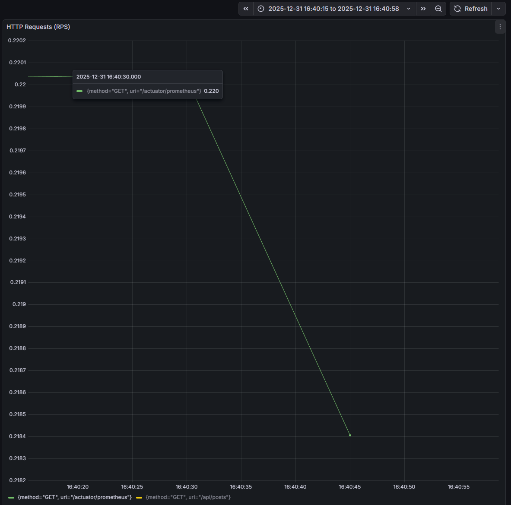
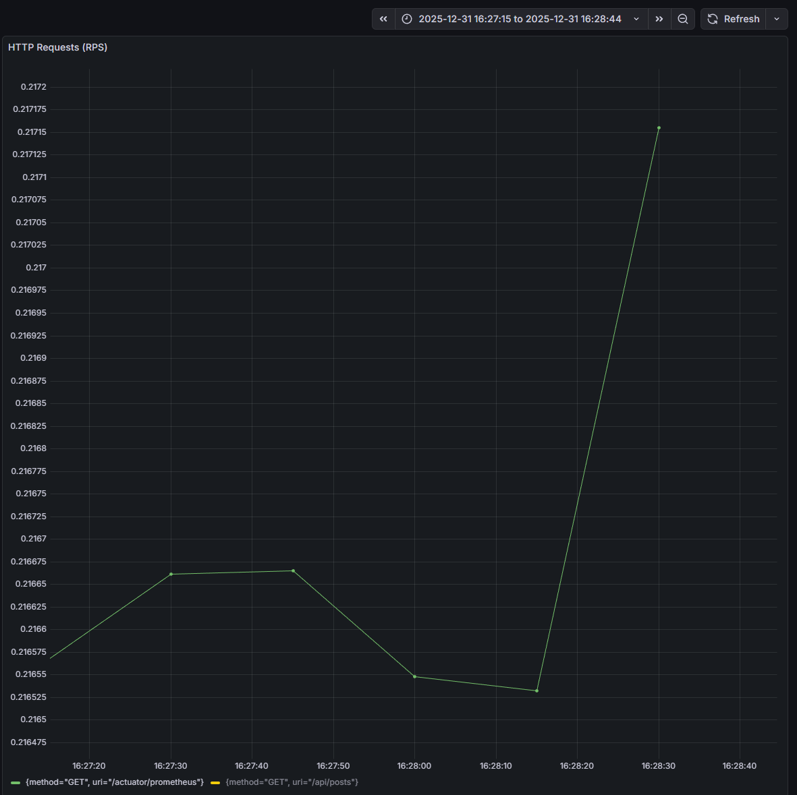
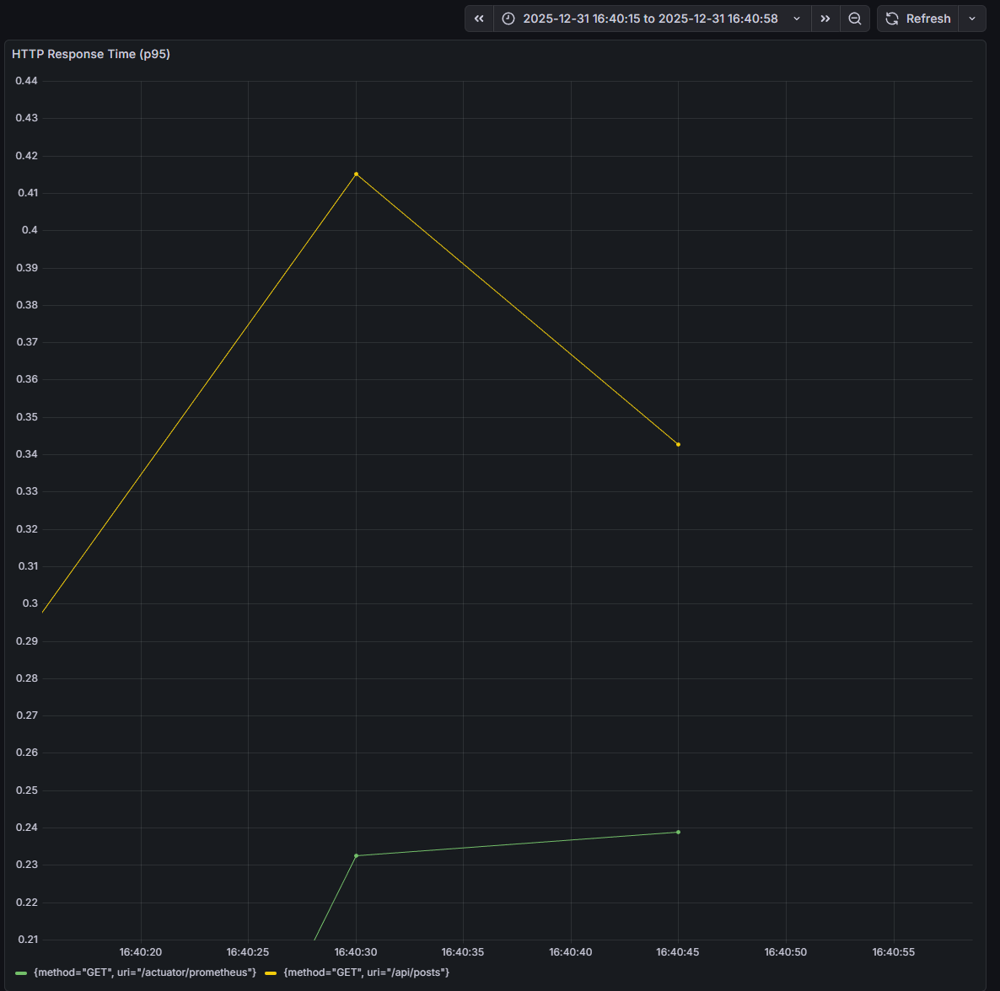
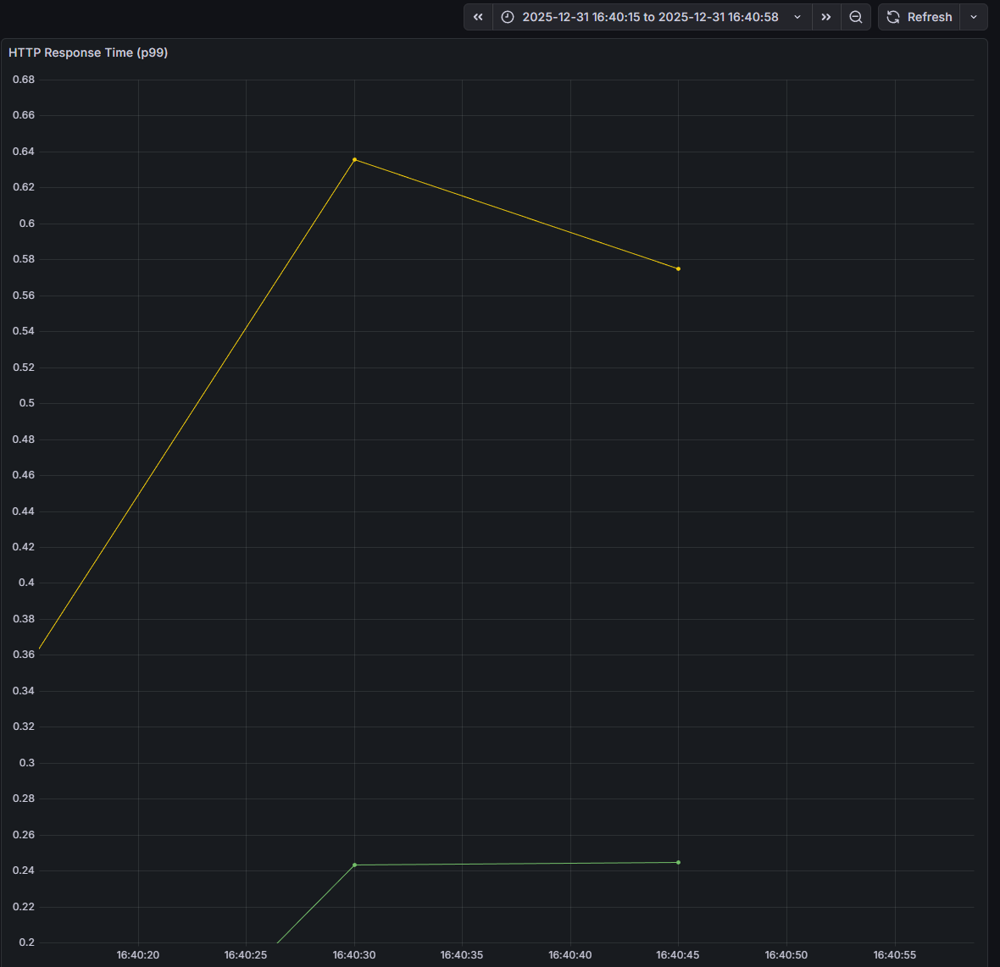
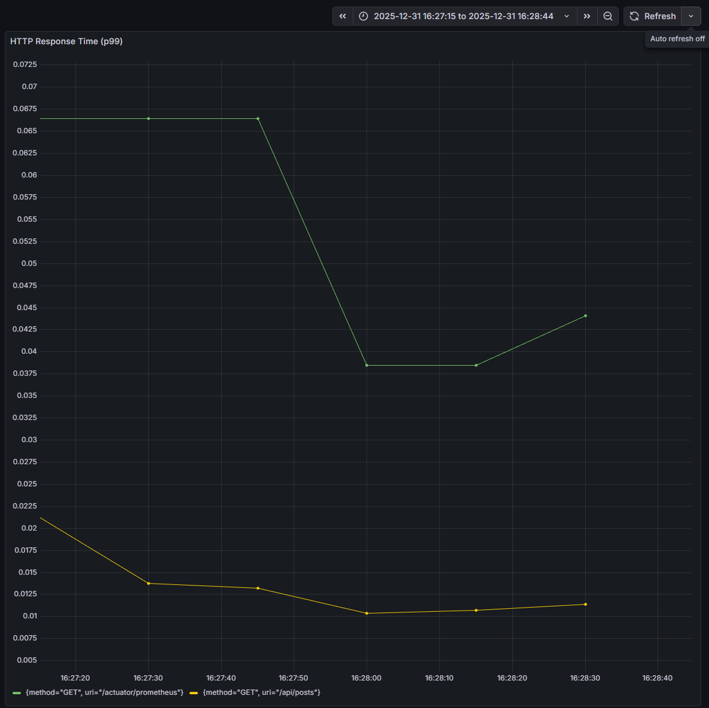

# Case1. 조회 성능 개선 (N+1)

## 1. 결과 요약

게시글 목록 조회 API에서 발생하던 N+1 쿼리 문제를 제거하였다.  
동일한 부하 조건에서 before / after 를 비교한 결과,  
요청 1회당 실행되는 쿼리 수가 고정되었고  
tail latency(p95 / p99)가 감소하거나 안정화되었다.
처리량(RPS)은 개선 전·후 동일 수준으로 유지되었다.

---

## 2. 검증 대상과 범위

- 대상 API: `GET /api/posts` (게시글 목록 조회)
- 문제 유형: N+1 쿼리로 인한 조회 성능 저하
- 비교 기준:
    - Before: 엔티티 기반 조회 후 연관 엔티티 접근 구조
    - After: DTO Projection + JOIN 기반 목록 전용 조회 구조

본 문서에서는 판단 배경이나 선택 이유를 다루지 않으며,  
사실과 결과만을 기록한다.

---

## 3. 사용한 핵심 지표

- RPS (Requests Per Second)
- p95 latency
- p99 latency

---

## 4. 대표 증거 (Grafana · Before / After)

아래 그래프는 **동일한 부하 조건과 동일한 시간 구간**에서 수집되었다.

### 4-1. RPS 비교 (Before / After)

**Before**


**After**


- 처리량(RPS)은 개선 전·후 동일 수준으로 유지됨

---

### 4-2. p95 Latency 비교 (Before / After)

**Before**


**After**


- 일부 요청에서 발생하던 지연 구간이 감소하거나 안정화됨

---

### 4-3. p99 Latency 비교 (Before / After)

**Before**


**After**


- tail latency 구간에서의 급격한 응답 시간 증가 현상이 완화됨

---

## 5. 산출물 위치 안내

본 Case의 모든 검증 산출물은 아래 경로에 정리되어 있다.

```text
portfolio/case1/
├─ Artillery/   # 동일 부하 조건 재현을 위한 실행 결과
├─ Grafana/     # RPS / p95 / p99 지표 캡처
├─ evidence/    # 코드 변경 및 SQL 발췌 증거
├─ raw/         # SQL 로그 원본 (가공 전)
└─ README.md    # 본 문서

각 산출물은  
“어떤 결과를 검증하기 위해 생성되었는지”를 기준으로 분리되어 있다.
```

---

## 6. 안내 (Velog · Evidence)

본 Case의 **판단 과정과 선택 이유**는 기술 블로그(Velog)에 정리되어 있으며,  
**실험 결과에 대한 검증 증거(PDF)** 는 GitHub Case1 폴더에 별도로 제공한다.

- Velog
    - [Case1 Velog – N+1 쿼리 문제 before/after 비교 실험 설계와 해결 선택](https://velog.io/@cw01483/N1-%EC%BF%BC%EB%A6%AC-%EB%AC%B8%EC%A0%9C-beforeafter-%EB%B9%84%EA%B5%90-%EC%8B%A4%ED%97%98%EC%9D%84-%EC%84%A4%EA%B3%84%ED%95%9C-%EC%9D%B4%EC%9C%A0%EC%99%80-%ED%95%B4%EA%B2%B0-%EC%84%A0%ED%83%9D)
- Evidence Pack (검증 증거 · 결과 원본)
    - [Case1_N+1_Query_Optimization_Evidence.pdf](./Case1_N+1_Query_Optimization_Evidence.pdf)